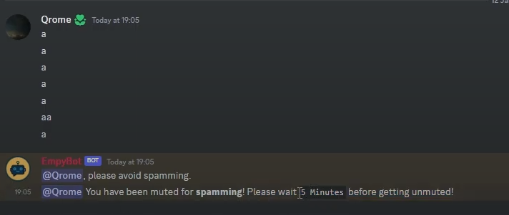
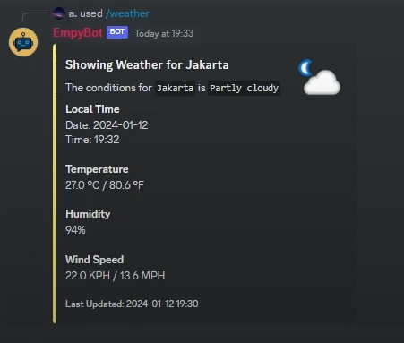

<div align="center">

</div>

# Multi-purpose Discord Bot (EmpyBot)
A multi purpose bot that is ready to be your versatile server companion. Keep it tidy, engage with polls, enjoy games, and stay informed about the weather effortlessly.

## Demonstration Video
Link: https://www.youtube.com/watch?v=ytGWfk4RLM0

## Requirements

1. Nextcord
```sh
pip install -U nextcord
```

2. AIOHTTP
```sh
pip install aiohttp
```
## Features
* Muting and Unmuting members


* Clearing messages

* Spam detection

* Poll creation


* Tic-tac-toe (Single player and PvP)


* Weather information display


## Creator
Name: Adrian Nugroho Basuki <br>
Class: L1AC <br>
ID: 2702298210
